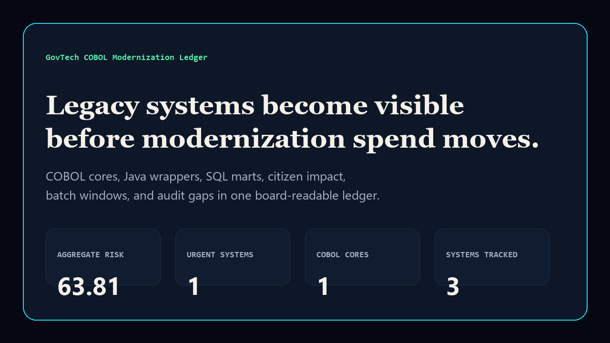
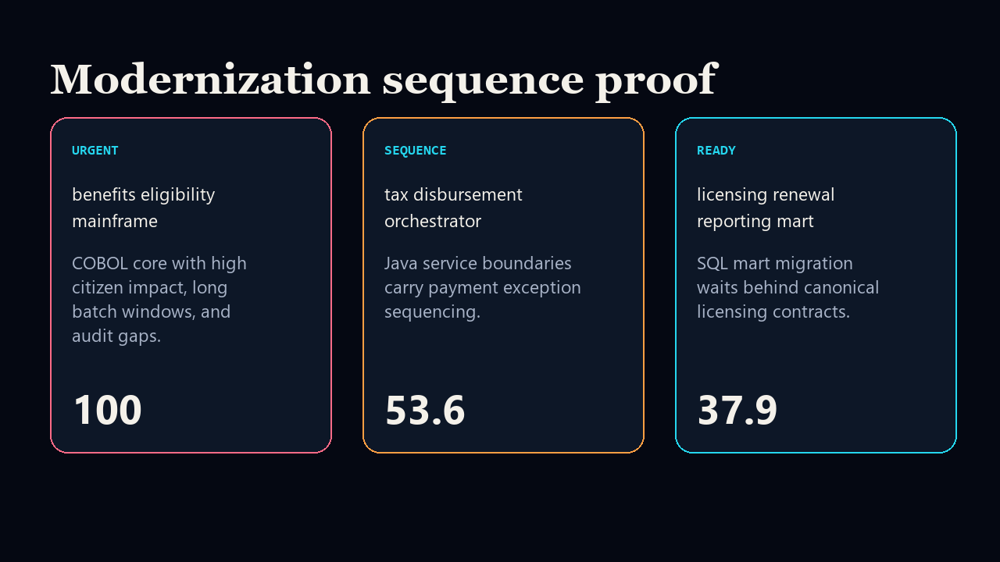

# govtech-cobol-modernization-ledger

[](https://github.com/mizcausevic-dev/govtech-cobol-modernization-ledger/actions/workflows/ci.yml)
[](https://github.com/mizcausevic-dev/govtech-cobol-modernization-ledger/actions/workflows/pages.yml)
[](LICENSE)

GovTech COBOL Modernization Ledger turns COBOL cores, Java service wrappers, SQL reporting marts, citizen impact, batch windows, audit gaps, interface count, and funding posture into one board-readable modernization sequence.

## Why this exists

- Public-sector modernization fails when legacy risk, citizen service exposure, audit posture, and funding readiness are discussed in separate workstreams.
- COBOL systems are not automatically bad; the risk is unmanaged dependency, unclear ownership, hidden batch windows, and modernization sequencing without evidence.
- Java wrappers and SQL reporting marts need to be scored in the same ledger as mainframe cores so leaders can decide what to freeze, sequence, fund, or defer.
- This repo provides practical GovTech / public-sector proof across COBOL, Java, and SQL without pretending a local COBOL compiler is always available.

## Screenshots





## What it includes

- TypeScript scoring model and static executive surface.
- Java parity check for modernization posture calculations.
- COBOL source contract for legacy posture framing.
- SQL views for modernization risk and board posture aggregation.
- Fixture data for benefits, tax disbursement, and licensing systems.
- CI, Pages deploy, smoke checks, screenshots, docs, and security notes.

## Local run

```bash
npm install
npm run verify
npm run prerender
```

## CLI

```bash
node dist/src/cli.js fixtures/modernization-ledger.json
```

## Language lanes

- `src/` contains the TypeScript scoring and app surface.
- `java/ModernizationLedger.java` validates score/posture parity in Java.
- `cobol/MODERNIZATION-POSTURE.cbl` is a contract-checked COBOL source artifact.
- `sql/modernization_risk_views.sql` models the reporting views a public-sector data office would expose.

## Board question answered

> Which public systems are exposed, which modernization sequence is safest, and what story can leadership tell before asking for funding?
